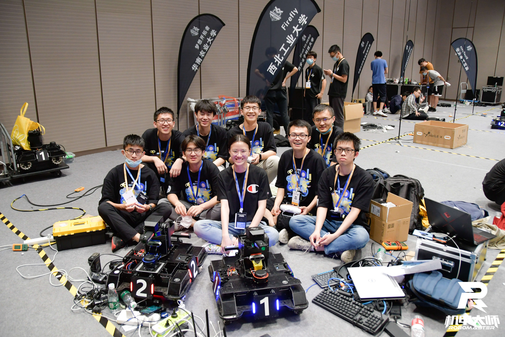

# RoboMaster人工智能挑战赛

## 比赛概述

​	RoboMaster 机甲大师高校人工智能挑战赛（RMUA, RoboMaster University AI Challenge）自2017年起已连续四年由DJI RoboMaster组委会与全球机器人和自动化大会联合主办，并先后在新加坡、澳大利亚、加拿大落地执行。该赛事吸引了全球大量顶尖学府、科研机构参与竞赛和学术研讨，进一步扩大了RoboMaster在国际机器人学术领域的影响力。比赛需要参赛队综合运用机械、电控和算法等技术知识，自主研发全自动射击机器人参赛，对综合技术能力要求极高。

​	

## 技术需求

高速定位

高帧识别

精准打击

