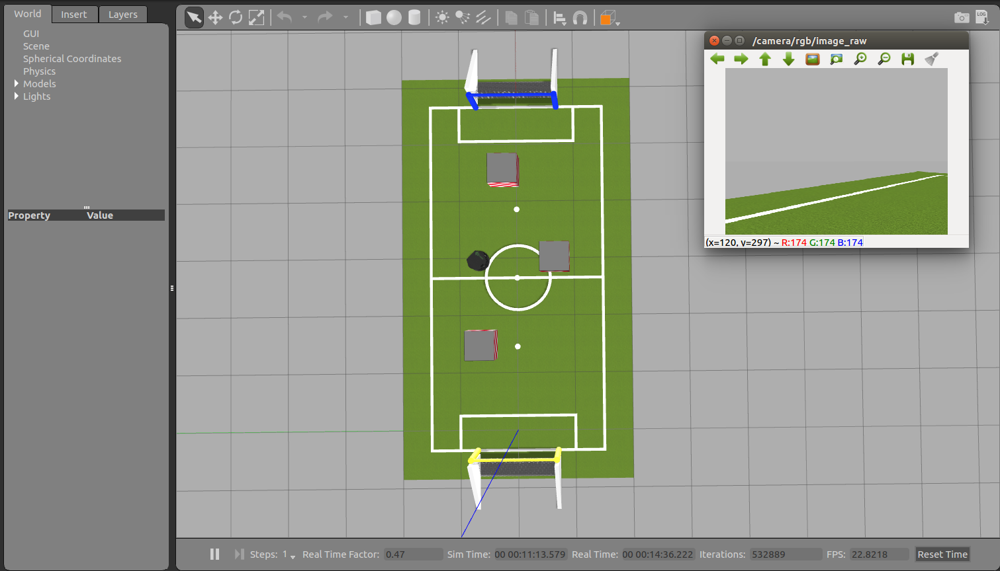

# 仿真避障

## 比赛概述

比赛要求是控制仿真平台中的小机器人从起点球门走到终点球门，并且过程中不能碰撞方块或摔倒。

比赛分为两种输入，纯视觉输入与视觉-箱子位置共同输入。纯视觉输入时控制仅能获得机器人身上单目相机拍摄到场地的信息，共同输入时还能获得此刻场地上箱子位置的信息以辅助控制。

比赛的难度在于机器人自身的定位与箱子的位置估计。这个比赛中定位只能依赖于控制量与相机信息，如不同时使用二者将造成开环控制，难以修正误差；箱子的位置估计基本上采用三维视觉来进行。

## 技术需求

视觉，纯视觉项目中，机器人的传感器只有单目相机，需要处理视觉信息以对外界环境进行一定程度上的建模。

ros，仿真平台是gazebo，本地调试时可以使用ros进行效果评估。

python代码能力，项目暂时仍然使用python2，不太便于使用。

导航与定位，完成了一半，实现了使用ros包的机器人导航，但因为比赛信息约束的原因，还需要完成纯视觉定位才能使用。

