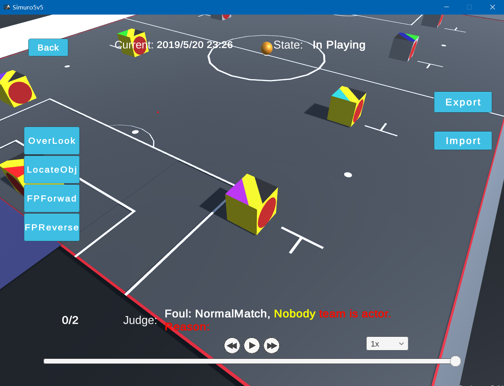

# 仿真足球

## 比赛概述

主要含有仿真5V5与仿真11V11两项，都是仿真机器人在足球方面的对抗，类似于仿真版的足球世界杯，因此比赛含有点球，传球，阵型等足球操作。

此外，近些年我们组还为仿真5V5开发了一个基于unity的仿真平台，使用起来比原本的比赛平台更舒适，观赏性也更高。

## 技术需求

大工程的阅读能力，项目代码很长，新开发之前要对整个运行过程有大致了解。

C++代码能力，目前项目代码为C++，开发者需要对熟悉C++的各种用法以理解代码逻辑并高效开发。

毅力，代码逻辑中有很多参数，调参是一件枯燥的事。

