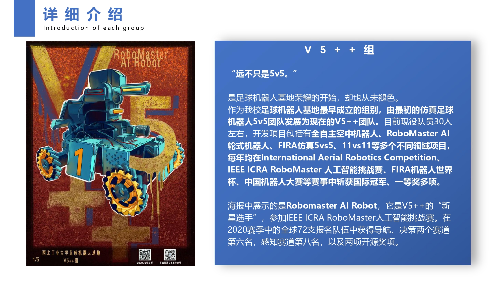
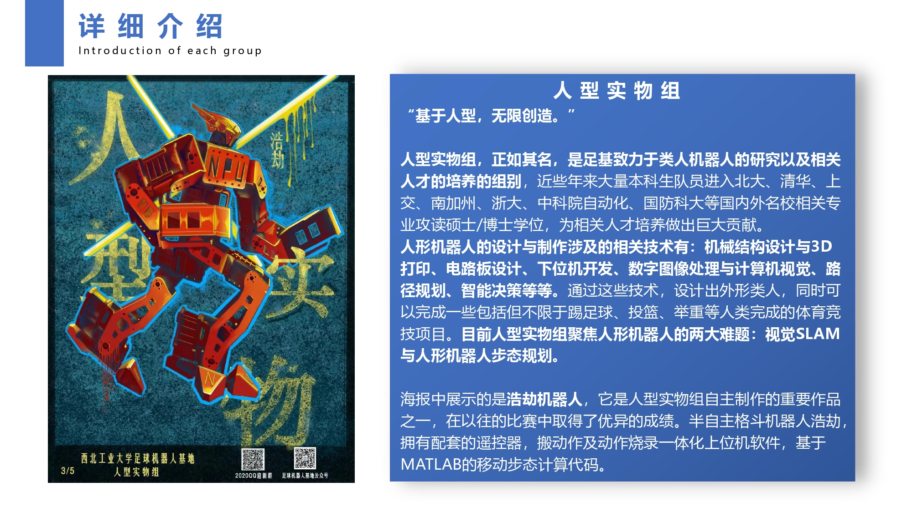
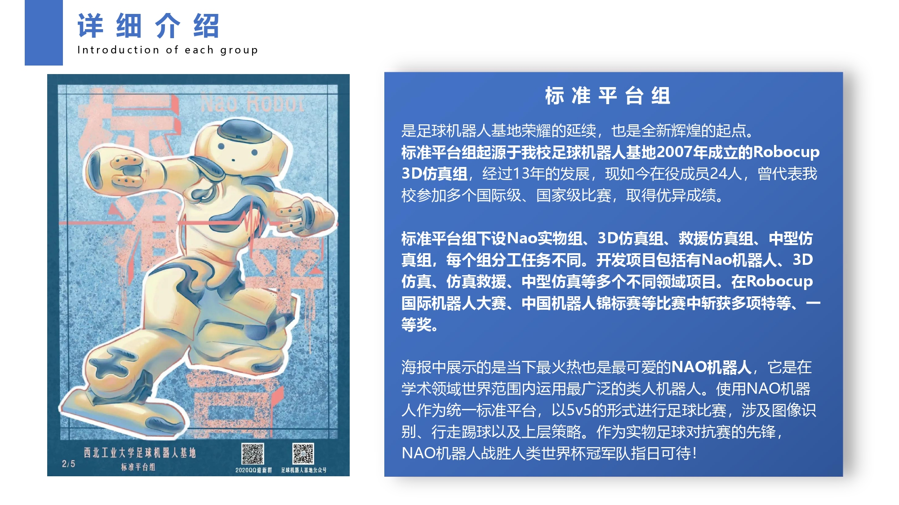
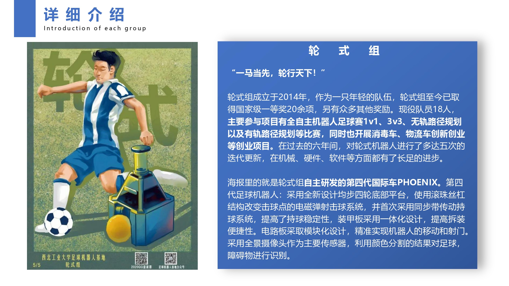
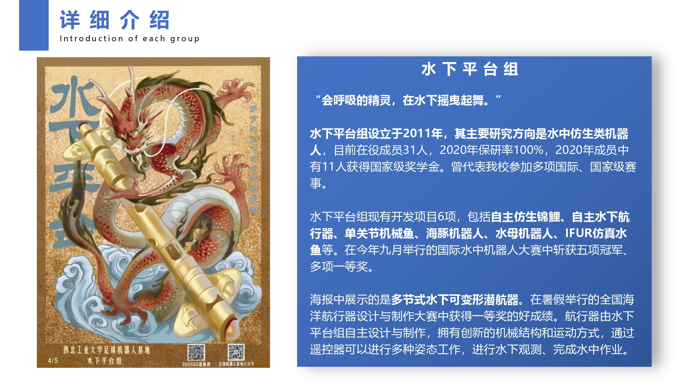
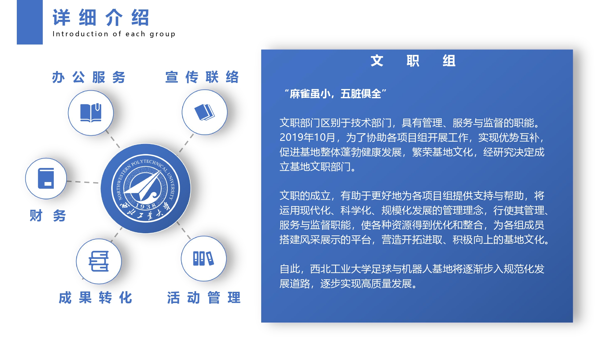

# 2021年秋季招新问题答疑

招新群群号：（702455284）

二维码：

## Q：此次招新只招2020级的同学吗？

**此次软件与硬件招新面向 2020 级与 2021 级全体成员，**而文职只招收 2021 级同学。

## Q：零基础可以参与吗？

当然可以参与~

不过因为 2020 级同学已经学过程序设计基础等编程基础课程，在考核中会有更大的优势。因此可能最后不会招收太多的 2021 级同学，不过没有入选的同学可以继续努力学习，在本学期末还会有一次大规模招新！

## Q：基地构成？

基地可以从两个方面来分组

### 根据参赛情况分组

根据参赛情况分组基地分为 **V5++ 、人型、标准平台、轮式、水鱼、文职** 六个组别，每个组参加的比赛一般不同，各自专注的方向也不同，各组特色鲜明、互相促进，共同构成足球与竞技机器人基地大家庭。各个组详细介绍如下：

**V5++：**传统项目为仿真 5v5 足球平台，获得中国机器人大赛冠军、全国机器人锦标赛冠军、中国机器人及人工智能大赛冠军等，队伍的轮式车在 2019 年首次参加世界杯小车项目，获得亚军；2020 年首次参加 ICRA RoboMaster 人工智能挑战赛，国际赛中取得第六名好成绩；同时也研究空中机器人项目，获得过全国机器人锦标赛一等奖等一些无人机奖项；仿真避障 11v11 足球中获得中国机器人大赛冠军、全国机器人锦标赛冠军等奖项。

**人组**：自主研发人性格斗机器人“浩劫”机器人，在国内多个机器人赛事中夺得冠军、一等奖等荣誉；设计研发制造全自主魔方机器人；自主开发新一代开放平台小型全自主机器人“莫扎特”机器人，也是关节型类人型机器人。

**标准平台组**：包括中型仿真组、救援仿真组、3D 仿真组、实物 NAO 组；在中国机器人大赛中型仿真足球赛冠军、Robocup 中国赛救援仿真二等奖、2020 全国机器人锦标赛多个一等奖。

**轮组**：轮式足球机器人，基地的机器人元老之一，依靠全景摄像头捕获的图像在足球门上进行自主定位与自主决策，完成一系列抓球、避障、传球、射门等动作。目前已经历4代技术更新，目前正在完成第五代技术更新，在国内处于领先水平，参加了全国机器人锦标赛、人工智能大赛、FIRA、挑战杯、创新创业大赛等多种比赛，并获得多个国家级奖项。

**鱼组**：参加国际水中机器人大赛，并获得包括冠军五项在内的十个奖项；鱼组队员中2人获得学生标兵荣誉，11人获得国家奖学金，4人获得专项奖学金；也参与过 RoboMaster 人工智能挑战赛、两项省级大创等，也自主开发了新式 ROV 。

**文职职责**：成立于2019年10月，文职部门区别于技术部门，具有引领、管理、服务与监督的职能。文职成立将更好地为各项目组提供支持与帮助，使各组资源得到优化整合，营造开拓进取、积极向上的基地文化。

### 根据技术方向分组

大的方向分为 **软件、硬件、机械** 三个组，而其中软件又包含 **定位、视觉、策略** 三个方向。 此次招新也是以此为标准招收，各个组详细介绍如下：

**软件-策略**：策略可以说是基地内部最大的组，每个比赛都离不开策略，策略的任务是根据

**机械**：机械组主要

## Q：此次招新是否招机械的同学？

此次招新只招收 文职、软件、硬件，不招收机械。同学可以在下次招新前来尝试~

## Q：如何报名？

### 软件 & 硬件

**9.2** ~ **考核开始**投递简历到邮箱 **zuqiuwenzhi@163.com** （无格式要求，自由发挥）

### 文职

**9.2 ~ 9.20** 进群（702455284）**下载报名表**并投递至 **zuqiuwenzhi@163.com**

## Q：考核流程是什么样子的？

### 软件

+ **9.2 ~ 9.10**   投递简历（尽快投递~涉及到考场的预约安排）

+ **9.11**             机试

+ **9.12 ~ 9.25** 大作业考核

+ **9.26 ~ ?**       面试（时间待定）

### 硬件

+ **9.3 ~ 9.10**    理论渐进式大作业（**硬件的同学别忘了加入硬件考核群：779297494**）

+ **9.7 ~ 9.10**    项目融合介绍及课题布置

+ **9.11 ~ 9.18**  代码类渐进式大作业

+ **9.22**              多文件编程能力机试

+ **9.22 ~ ?**        面试（时间待定）

### 文职

+ **9.2 ~ 9.20**    投递简历

+ **9.21 ~ ?**        面试（时间待定）

## Q：基地忙吗？

基地每个组每周大约集训 **9 ~ 12** 小时，每个组时间安排不同

寒假暑假会有一段时间留校集训准备比赛，具体时长看比赛的任务多少

## Q：进基地对语言类别有要求吗？

据我所知基地中的语言 C、C++、Python、Java 等都有用

一般来说有了 C 和 C++ 的基础就已经足够了

## Q：软件的机试和大作业对语言有要求吗？

无要求，任何你会的语言都可以用

## Q：可以同时报软件和硬件吗？

理论上可以，如果你的时间足够充裕

