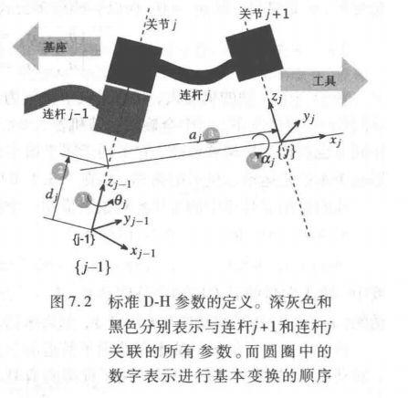

# 机械臂

## D-H表示法

### 坐标系规定

《机器人学、机器视觉与控制》P133

研究两个关节之间的关系，进而可以拓展到各关节到末端的关系（输入给关节，输出到末端执行器）。典型关节有两类，R（旋转关节）与P（滑移关节）。为了确定每个关节的状态，每个关节都用一个坐标系来描述，D-H法的本质就是用一套规范的形式得出相邻关节间的TF变换。

关节坐标系的规定如下：

* 第j个关节对应的关节坐标系为{j-1}，连接着j-1和j两个连杆，j从1开始。这表明存在一个连杆0，代表机器人底座（有时会为底座规定一个对于整体机械臂而言的世界坐标系，便于构造1关节的x轴）。从底座到末端执行器下标逐渐增大。

* 各坐标系z轴沿着旋转关节的旋转轴或滑移关节的滑移方向。可标记出所有z轴。
* x~j~由z~j~与z~j-1~决定，常规情况下，x~j~沿着z~j~与z~j-1~的公垂线方向（异面直线情况）。当z~j~与z~j-1~平行，x~j~可选与上一条公垂线共线。当z~j~与z~j-1~相交，x~j~可选为z~j~与z~j-1~轴的外积，即z~j~与z~j-1~面的法线，并且原点为z~j~与z~j-1~交点
* y轴依据xz选，使其符合右手系。D-H法中不使用y轴，这导致D-H法不能处理沿着轴第二方向运动的问题。

### 实施步骤

以图中的旋转关节为例

1. 绕z~j-1~旋转坐标系$\{j-1\}$使x~j-1~与x~j~平行同方向。对应`变量`$\theta_j$​​​​

2. 沿着z~j-1~平移$\{j-1\}$使其原点落在x~j~线上。对应`常量`$d_j$

3. 沿着x~j~方向平移$\{j-1\}$使其与$\{j\}$原点重合（此时x~j~轴与x~j-1~也重合）。对应`常量`$a_j$

4. 绕x~j-1~轴旋转使zj-1与z~j~重合。对应`常量`$\alpha_j$

也就是说:
$$
^{j-1}A_{j}(\theta_j,d_j,a_j,\alpha_j)=T_{Rz}(\theta_j)T_z(d_j)T_x(a_j)T_{Rx}(\alpha_j)
$$
注意到使用了右乘。这个tf描述了坐标系从$\{j-1\}$如何成为$\{j\}$

实际上一个R和P型关节都只能提供一个自由度，要么是$\theta_j$，要么是$d_j$，统一为广义关节坐标$q_i$，它们决定了末端执行器坐标系相对底座坐标系的TF。​

一般的机械臂都具有6~7个关节，以获取完全的行动能力。大于6的自由度存在更多的逆运动多解，这能够使机械臂执行避障等操作，而执行器保持原姿态。

依赖于需求，低自由度机械臂也有作用。

## 正运动学

利用广义关节坐标求末端执行器坐标系相对底座坐标系的TF。

## 逆运动学

欲达到目标末端执行器位姿，广义关节坐标需要到达的值。

高自由度逆运动学一般是多解的，但可能有奇异点（丢失自由度）、边界点（不能达到期望姿态）。

## 雅可比矩阵

《机器人学、机器视觉与控制》P169

输出末端姿态$\mathbf{Y}=[p_x,p_y,p_z,\alpha_x,\alpha_y,\alpha_z]^T$是关节变量的函数，即$\mathbf{Y}(\mathbf{q})$。研究速度时，先对$\mathbf{Y}$求全微分再除以时间微元，可以得到：
$$
\frac{d\mathbf{Y}}{dt}=

\begin{bmatrix}
v_x\\
v_y\\
v_z\\
w_x\\
w_y\\
w_z
\end{bmatrix}=

\begin{bmatrix}
\frac{dY_1}{dq_1}&\frac{dY_1}{dq_2}&\cdots&\frac{dY_1}{dq_n}\\
\frac{dY_2}{dq_1}&\frac{dY_2}{dq_2}&\cdots&\frac{dY_2}{dq_n}\\
\vdots&\vdots&\ddots&\vdots\\
\frac{dY_6}{dq_1}&\frac{dY_6}{dq_2}&\cdots&\frac{dY_6}{dq_n}\\
\end{bmatrix}\cdot

\begin{bmatrix}
\frac{dq_1}{dt}\\
\frac{dq_2}{dt}\\
\vdots\\
\frac{dq_n}{dt}
\end{bmatrix}

=\mathbf{J}(\mathbf{q})\cdot\dot{\mathbf{q}}
$$
其中$n$是机械臂广义关节变量数，$\mathbf{J}$​​是雅可比矩阵，通常其元素是变化的。

反过来，欲使末端姿态变化时，可以配合雅可比矩阵的逆求解关节变量应当如何变化，这就是一种速度控制。当雅可比矩阵病态时，就有可能导致关节变量的解很巨大。

还有一种雅可比矩阵用于转换两个坐标系下的速度，见《机器人学、机器视觉与控制》P170

