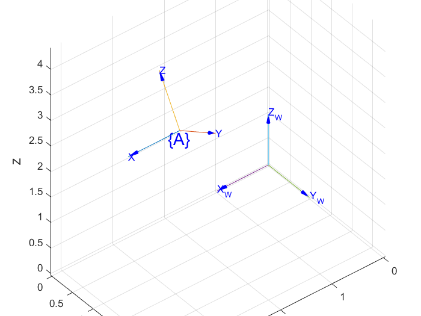

# TF(坐标系变换)

[toc]

## 变换与描述

每一个部件一般都工作在它自身的坐标系下，但为了协调整体系统我们需要做出一些规范。所以需要研究部件自身坐标系和我们感兴趣的坐标系之间的关系，这就是tf（transform）

图中的$\{A\}$​坐标系就是部件自身坐标系，$\{W\}$​​是我们感兴趣的坐标系（如在它的基础上处理信息）。部件坐标系内的信息（如激光点位置信息）经过tf转化到我们定义的坐标系$\{W\}$​​中。​也就是说信息是固定的，只是在基$\{A\}$与基$\{W\}$​下有不同的表达（坐标）。

部件自身的坐标系规定值得关注，不同系统的默认坐标系有较大差别，如相机坐标系、雷达坐标系、陀螺仪坐标系等。欧拉角的RPY有时也会依赖于此设定，通常R-X,P-Y,Y-Z旋转对应，但有时部件的XYZ定义不同于横滚、俯仰、偏航，则RPY不再对应XYZ。

教程内容针对右乘，即每一步处理基于上一步处理。

首先阐述特殊的tf，纯平移与纯旋转，引出更一般的情况

### 平移

如图是绘制的一个纯平移情况，$\{A\}$系定义在$\{W\}$系下$(2,2,0)$​的位置。容易发现$\{A\}$系中的坐标可以通过简单的加减法变换到$\{W\}$​​系的坐标，这个偏差即$\{A\}$坐标系原点的变换。
$$
\left[
\begin{matrix}
^Wx\\^Wy\\^Wz
\end{matrix}
\right]
=
\left[
\begin{matrix}
^Ax\\^Ay\\^Az
\end{matrix}
\right]
+
\left[
\begin{matrix}
A_x\\A_y\\A_z
\end{matrix}
\right]
$$
其中$^Wx$​这些都代表下标，$W$写在左上角意味着它是一个下标，也代表着它的基采用$W$系基。$A_x$这项代表的是坐标系$\{A\}$原点在$\{W\}$​系的坐标。

### 旋转

一个旋转可以分解为绕三个坐标轴的旋转，所以只需要分别分析绕各轴旋转，就可组合得到任意的具体旋转。

这里举例的是绕Z轴的旋转，$\{A\}$系定义在$\{W\}$系下绕Z轴旋转$30\degree$​的位置，根据线性代数基变换的知识（可参考《机器人学、机器视觉与控制》P18），可以得到：
$$
\left[
\begin{matrix}
^Wx\\^Wy\\^Wz
\end{matrix}
\right]
=
\left[
\begin{matrix}
cos\theta&-sin\theta&0\\
sin\theta&cos\theta&0\\
0&0&1
\end{matrix}
\right]
\left[
\begin{matrix}
^Ax\\^Ay\\^Az
\end{matrix}
\right]
=
R_z(\theta)
\left[
\begin{matrix}
^Ax\\^Ay\\^Az
\end{matrix}
\right]
$$
这里$\theta$即带入30$\degree$​，它的正负符合右手系规定，大拇指指向第三轴，其余四指握方向为正方向。

一共有三种旋转，$R_x(\theta),R_y(\theta),R_z(\theta)$，它们元素的位置略有不同，但都是单位正交阵。他们之间可以进行组合以表示复杂的姿态，但注意旋转不符合交换律，不同顺序的旋转经常会得到不同的结果，所以左右乘很重要，它们的意义在后文叙述。

### 齐次表示

可以使用一个矩阵综合旋转与平移的信息，它的结构为：
$$
^WT_A=
\left[
\begin{matrix}
^W\mathbf{R}_A&\mathbf{t}\\
\mathbf{0}_{1\times3}&1
\end{matrix}
\right]
$$
其中$^W\mathbf{R}_A$​是旋转矩阵，$\mathbf{t}$​是平移向量，上标$W$​和下标$A$​​指出当前变换的基是$W$​系的基，目标是$A$的基，对于下标变换就有：
$$
\left[
\begin{matrix}
^Wx\\^Wy\\^Wz
\end{matrix}
\right]
=
^{W}T_A
\left[
\begin{matrix}
^Ax\\^Ay\\^Az
\end{matrix}
\right]
$$
它可以解释为将$\{A\}$系中的一个下标变换到$\{W\}$​系下标。

### 左乘与右乘

具体是指变换矩阵可以由左乘和右乘构成，可以混合使用，但为了清楚一般只使用一种，纯右乘被使用的更多。

简单地说，左乘变换矩阵的效果是每一步都以全局系进行操作，如定义变换$\mathbf{P}_A=(rotx\cdot roty)\cdot \mathbf{P}_W$​​相当于描述了坐标系$\{A\}$​的形成是先绕着$\{W\}$​系的y轴旋转，再绕着$\{W\}$​​系的x轴旋转。

而右乘是每一步都以上一步的结果继续操作，如定义变换$\mathbf{P}_A=(rotx\cdot roty)\cdot \mathbf{P}_W$​相当于描述了坐标系$\{A\}$​的形成是先绕着$\{W\}$​系的x轴旋转得到$\{W_1\}$系，再绕着$\{W_1\}$​系的y轴旋转得到$\{A\}$系。

注意到这里的举例变换矩阵是相同的，说明左乘与右乘虽然生成顺序不同，解释不同，但可以等价。

## 旋转法

### 欧拉角

欧拉角提供了一种非常直观的方式来描述旋转，它使用了3个分离的转角，把一个旋转分解成3次绕轴旋转。如旋转顺序XYZ，ZYZ等，欧拉证明了只要三次绕轴旋转连续两次是不同轴，它就能组合出任意姿态。

但是使用姿态反解旋转角时存在奇异点，有一些特殊情况会丢失自由度，任何排序的欧拉角都有这种问题，只是奇异点可能不同。姿态的自由度确实是3，但使用三个参数描述是不太充分的。

### 四元数

全面推导见《quaternion.pdf》，引用自[Krasjet的项目](https://github.com/Krasjet/quaternion)

任何旋转可以表示为绕某轴$\mathbf{u}$旋转了某角度$\theta$​，与欧拉角时的不同是轴未必是坐标轴，可以是任意的。

四元数是一种复数的拓展，它有一维实部，三维虚部，即$\mathbf{q}=s+\mathbf{v}=s+v_1\mathbf{i}+v_2\mathbf{j}+v_3\mathbf{k}$​​​​。

使用四元数可以表示纯旋转的变换关系，并且不存在奇异点，这是因为它引入了第四个参数。已知旋转轴$\mathbf{u}$​​​（单位向量）和旋转角$\theta$​​​旋转向量$\mathbf{v}$​​​到$\mathbf{v}'$​​，变换四元数可以被表示为$\mathbf{q}=[cos(\frac{\theta}{2}),sin(\frac{\theta}{2})\mathbf{u}]$​​，并且这是个单位四元数，也就有共轭等于逆$\mathbf{q}^*=\mathbf{q}^{-1}$​​​，，将旋转向量也放入四元数$\mathbf{\upsilon}=[0,\mathbf{v}]$​最终有：
$$
\mathbf{\upsilon}'=[0,\mathbf{v}']=\mathbf{q}\mathbf{\upsilon}\mathbf{q}^{-1}=\mathbf{q}\mathbf{\upsilon}\mathbf{q}^{*}
$$
反过来，如果已知变换四元数$\mathbf{q}=[s,\mathbf{v}]$，就有$\frac{\theta}{2}=cos^{-1}(s)$与$\mathbf{u}=\frac{\mathbf{v}}{sin(cos^{-1}(s))}$​得到旋转参数。​

代码实现上，经常将实部放在后面，即有xyzw四个量，w为实部，xyz为三个虚部。
